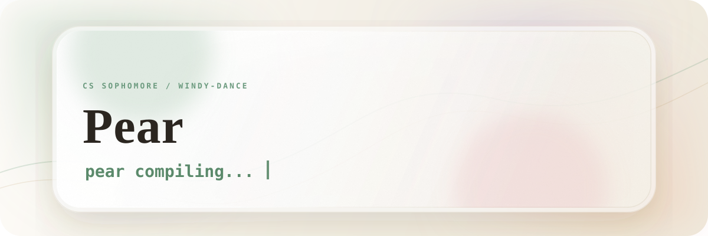

<picture>
  <source media="(prefers-color-scheme: dark)" srcset="pear-header-dark.svg">
  
</picture>

I study Computer Science on campus, while leaving room for the things that make life feel larger than a syllabus.

---

<div style="font-size:13px;color:#8b949e;letter-spacing:1px">INTERESTS</div>

literature · philosophy · games · music — and the slow joy of learning until something finally becomes mine.

---

<div style="font-size:13px;color:#8b949e;letter-spacing:1px">DIVING INTO</div>

<p>
  
  
  
  
  
  
  
  
  
</p>

---

<div style="font-size:13px;color:#8b949e;letter-spacing:1px">STATUS</div>

```text
$ cat status.txt
learning slowly · thinking widely · building small things
```

---

<div style="font-size:13px;color:#8b949e;letter-spacing:1px">BLOG</div>

[windy-dance.github.io ↗](https://windy-dance.github.io)

---

<div align="center">

*I leave all my cares and doubts to follow the homeless tide,<br>
for the Stranger calls me, he is going along the road.*

<sub>— Rabindranath Tagore, *Fruit-Gathering*</sub>

</div>